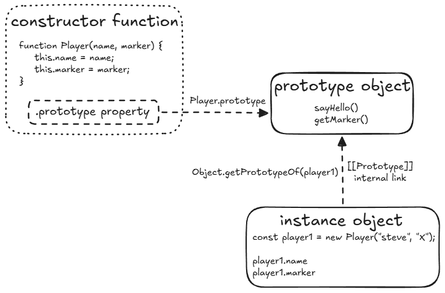

# Object Constructors

Manually typing out the contents of all of our objects with object literals is not always feasible. When you have a specific type of object that you need to make multiple of, a better way to create them is using an object constructor, which is really just a function.

The only difference is that you use it by calling the function with the keyword `new`. This is not the same as calling `Player("steve", "X")` (without the `new` keyword). When we call a function with `new`, it creates a new object, makes `this` inside the function refer to that object, and makes that object inherit from the function’s `.prototype` property (more on that later). The new object is then returned (even though we don’t specify a `return` value in the constructor function).

```javascript
function Player(name, marker) {
  this.name = name;
  this.marker = marker;
  this.sayName = function () {
    console.log(this.name);
  };
}

const player = new Player('steve', 'X');
console.log(player.name); // "steve"
const player1 = new Player('steve', 'X');
const player2 = new Player('also steve', 'O');
// Just like with objects created using the object literal method, you can add functions to the object.
player1.sayName(); // logs "steve"
player2.sayName(); // logs "also steve"
```

> [!WARNING] Safeguarding constructors
> Since constructors can be called without using `new` by mistake, which would cause hard-to-track errors as it won’t do all the new object and `this` binding stuff, we should safeguard them. You can use the `new.target` meta-property like this, which will throw an error if `Player` is called without `new`:
>
> ```javascript
> function Player(name, marker) {
>   if (!new.target) {
>     throw Error("You must use the 'new' operator to call the constructor");
>   }
>   this.name = name;
>   this.marker = marker;
>   this.sayName = function () {
>     console.log(this.name);
>   };
> }
> ```

## Exercise

### Reference

Working [HTML File][1] and working [JavaScript File][2].

[1]: ./exercise/book-exercise.html
[2]: ./exercise/book-exercise.js

Write a constructor for making “Book” objects. We will revisit this in the next project. Your book objects should have the book’s `title`, `author`, the number of `pages`, and whether or not you have `read` the book.

Put a function `info()` into the constructor that can report the book info like so: `console.log(theHobbit.info()); // "The Hobbit by J.R.R. Tolkien, 295 pages, not read yet"`

> [!TIP] console.log vs return
> We use examples of functions that call `console.log()` for demonstration, but instead of making functions directly log things, it’s generally more sensible to make them `return` values. That way, you can pass the values wherever you wish without being tied to whatever that function does; you may not always want to log the value.

## The Prototype

All objects in JavaScript have a **prototype**, otherwise referred to as its `[[Prototype]]`. The `[[Prototype]]` is another object that the original object **inherits** from, which is to say, the original object has access to all of its `[[Prototype]]`’s methods and properties.

### The `[[Prototype]]` is another object

The `[[Prototype]]` _is just another object_, like the `player1` and the `player2` objects in the example above. The `[[Prototype]]` object can have properties and functions, just as these `Player` objects have properties like `.name`, `.marker`, and functions like `.sayName()` attached to them.

### Accessing an object’s `[[Prototype]]`

Conceptually, you now might feel like you know, or at least have an idea of what a `[[Prototype]]` of an object is. But how do you _know_ or actually _see_ what the prototype of an object is? Let’s find out. You can try running the following code in the developer console of your browser. (Make sure you’ve created the `player1` and `player2` objects from before!)

```javascript
Object.getPrototypeOf(player1) === Player.prototype; // returns true
Object.getPrototypeOf(player2) === Player.prototype; // returns true
```

- **All objects in JavaScript have a `[[Prototype]]`**:
  - You can check the object’s `[[Prototype]]` by using the `Object.getPrototypeOf()` function on the object, like `Object.getPrototypeOf(player1)`.
  - `Object.getPrototypeOf(player1)` will return the object at the `.prototype` property of the `Player` constructor (i.e. `Player.prototype`).
- **The `[[Prototype]]` is another object...**
  - The _value_ of the `Player.prototype` contains an object.
  - A _reference_ to `Player.prototype` is stored in every instance of a `Player` object as its `[[Prototype]]`.
  - Hence, `true` is returned when you get `player1`’s `[[Prototype]]` and check for referential equality against the object at `Player.prototype`.
- **...that the original object _inherits_ from, and has access to all of its `[[Prototype]]`’s methods and properties**:
  - So, any properties or methods defined on `Player.prototype` will be available to the created `Player` objects!

The last sub-item needs a little more explanation. What does defining ‘on the prototype’ mean? Consider the following code:

```javascript
Player.prototype.sayHello = function () {
  console.log("Hello, I'm a player!");
};

player1.sayHello(); // logs "Hello, I'm a player!"
player2.sayHello(); // logs "Hello, I'm a player!"
```

Here, we defined the `.sayHello` function ‘on’ the `Player.prototype` object. It then became available for the `player1` and the `player2` objects to use! Similarly, you can attach other properties or functions you want to use on all `Player` objects by defining them on the objects’ `[[Prototype]]` (which is `Player.prototype`).

> [!NOTE] **`.__proto__`**
> In some docs or codebases, you may see `.__proto__` being used on an object to get or set its `[[Prototype]]` instead of using `Object.getPrototypeOf()` or `Object.setPrototypeOf()`. This is due to historical reasons; `.__proto__` is a non-standard and deprecated approach, so it is not recommended to use it to access an object’s `[[Prototype]]`.

---

> [!NOTE] **`Object.getPrototypeOf()` vs `.prototype`**
> A common cause of confusion comes from dealing with the `.prototype` property of constructor functions.
> `.prototype` is a property of functions that determines what a new object instance’s `[[Prototype]]` will be set to when the function is called with `new`. `.prototype` is _not_ for accessing an object’s `[[Prototype]]` - that’s what `Object.getPrototypeOf()` is for.
>
> 

### Prototypal inheritance

- We can define properties and functions common among all objects on a prototype to save memory. Defining every property and function takes up a lot of memory, especially if you have a lot of common properties and functions, and a lot of created objects! Defining them on a centralized, shared object which the objects have access to, thus saves memory.
- The second reason is the name of this section, **Prototypal Inheritance**, which we’ve referred to in passing earlier, in the introduction to the Prototype. In recap, we can say that the `player1` and `player2` objects inherit from the `Player.prototype` object, which allows them to access functions like `.sayHello`.

```javascript
// Player.prototype.__proto__
Object.getPrototypeOf(Player.prototype) === Object.prototype; // true

// Output may slightly differ based on the browser
player1.valueOf(); // Output: Object { name: "steve", marker: "X", sayName: sayName() }
```

What’s this `.valueOf` function, and where did it come from if we did not define it? It comes as a result of `Object.getPrototypeOf(Player.prototype)` having the value of `Object.prototype`! This means that `Player.prototype` is inheriting from `Object.prototype`. This `.valueOf` function is defined on `Object.prototype` just like `.sayHello` is defined on `Player.prototype`.

How do we know that this `.valueOf` function is defined on `Object.prototype`? We make use of another function called `.hasOwnProperty`:

```javascript
player1.hasOwnProperty('valueOf'); // false
Object.prototype.hasOwnProperty('valueOf'); // true
```

Now where did this `.hasOwnProperty` function come from? A quick check helps: `Object.prototype.hasOwnProperty("hasOwnProperty"); // true`

Essentially, this is how JavaScript makes use of prototypes. An object inherits from its `[[Prototype]]` object which in turn inherits from its own `[[Prototype]]` etc., thus forming a chain. This kind of inheritance using prototypes is hence named as Prototypal inheritance. JavaScript figures out which properties exist (or do not exist) on the object and starts traversing the chain to find the property or function, like so:

1. Is the `.valueOf` function part of the `player1` object? No, it is not. (Remember, only the `name`, `marker` and `sayName` properties are part of the `Player` objects.)
2. Is the function part of the `player1`’s `[[Prototype]]` (the `Object.getPrototypeOf(player1)` value, i.e., `Player.prototype`)? No, only the `.sayHello` function is a part of it.
3. Well, then, is it part of `Object.getPrototypeOf(Player.prototype)` (=== `Object.prototype`)? Yes, `.valueOf` is defined on `Object.prototype`!

However, this chain does not go on forever, and if you have already tried logging the value of `Object.getPrototypeOf(Object.prototype)`, you would find that it is `null`, which indicates the end of the chain. And it is at the end of this chain that if the specific property or function is not found, `undefined` is returned.

> [!NOTE]
> Every prototype object inherits from `Object.prototype` by default, whether directly or indirectly.
>
> An object’s `Object.getPrototypeOf()` value can only be _one_ value (an object cannot have multiple `[[Prototype]]`s).

### Recommended method for prototypal inheritance

Now, how do you utilize Prototypal Inheritance? What do you need to do to use it? Just as we use `Object.getPrototypeOf()` to ‘get’ or view the `[[Prototype]]` of an object, we can use `Object.setPrototypeOf()` to ‘set’ or mutate it. Let’s see how it works by adding a `Person` Object Constructor to the `Player` example, and making `Player` inherit from `Person`!

```javascript
function Person(name) {
  this.name = name;
}

Person.prototype.sayName = function () {
  console.log(`Hello, I'm ${this.name}!`);
};

function Player(name, marker) {
  this.name = name;
  this.marker = marker;
}

Player.prototype.getMarker = function () {
  console.log(`My marker is "${this.marker}"`);
};

Object.getPrototypeOf(Player.prototype); // returns Object.prototype

// Now make `Player` objects inherit from `Person`
Object.setPrototypeOf(Player.prototype, Person.prototype);
Object.getPrototypeOf(Player.prototype); // returns Person.prototype

const player1 = new Player('steve', 'X');
const player2 = new Player('also steve', 'O');

player1.sayName(); // Hello, I'm steve!
player2.sayName(); // Hello, I'm also steve!

player1.getMarker(); // My marker is "X"
player2.getMarker(); // My marker is "O"
```

From the code, we can see that we’ve defined a `Person` from whom a `Player` inherits properties and functions, and that the created `Player` objects are able to access both the `.sayName` and the `.getMarker` functions, in spite of them being defined on two separate `.prototype` objects! This is enabled by the use of the `Object.setPrototypeOf()` function. It takes two arguments - the first is the one which inherits and the second argument is the one which you want the first argument to inherit from. This ensures that the created `Player` objects are able to access the `.sayName` and `.getMarker` functions through their prototype chain.

> [!NOTE]
> Though it seems to be an easy way to set up Prototypal Inheritance using `Object.setPrototypeOf()`, the prototype chain has to be set up using this function before creating any objects. Using `setPrototypeOf()` after objects have already been created can result in performance issues.

---

> [!WARNING]
> A warning… this doesn’t work:
>
> `Player.prototype = Person.prototype;`

Both `Player.prototype` and `Person.prototype` become the exact same object in memory. This means any changes made to `Player.prototype` will also affect `Person.prototype`, which is not the intended behavior. Instead, we should make `Player.prototype` inherit from `Person.prototype`, rather than making them the same object. Consider one more example:

```javascript
function Person(name) {
  this.name = name;
}

Person.prototype.sayName = function () {
  console.log(`Hello, I'm ${this.name}!`);
};

function Player(name, marker) {
  this.name = name;
  this.marker = marker;
}

// Don't do this!
// Use Object.setPrototypeOf(Player.prototype, Person.prototype)
Player.prototype = Person.prototype;

function Enemy(name) {
  this.name = name;
  this.marker = '^';
}

// Not again!
// Use Object.setPrototypeOf(Enemy.prototype, Person.prototype)
Enemy.prototype = Person.prototype;

Enemy.prototype.sayName = function () {
  console.log('HAHAHAHAHAHA');
};

const carl = new Player('carl', 'X');
carl.sayName(); // Uh oh! this logs "HAHAHAHAHAHA" because we edited the sayName function!
```

If we had used `Object.setPrototypeOf()` in this example, then we could safely edit the `Enemy.prototype.sayName` function without changing the function for `Player` as well.
